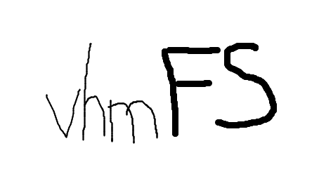

# BasicOS-team6




### Team members
- Hamza Jad Al Aoun: ***create***, ***ls***
- Moaad Maaroufi: ***write***, ***size***
- Villon Chen: ***read***, ***remove***

### Supervisors
- Ludovic Apvrille
- Sophie Coudert

---

## Setup

Compile the code:
```bash
make
```
Compilation output will be inside `./build`

Clear build directory
```bash
make clear
```

---

## Usage


```bash
$ ./build/vmhFS

vmhFS - a simple file system named after: Villon, Hamza and Moaad
Usage: vmhFS FILE COMMAND

OPTIONS:
        FILE
                Path to the file system (e.g. /tmp/myFS)
        COMMAND
                Available commands: create, write, read, remove, ls and size
                vmhFS FILE COMMAND to get help about the COMMAND
```

```bash
$ ./build/vmhFS /tmp/tmpFS ls

Usage: vmhFS FILE ls [OPTIONS] DIR_PATH
OPTIONS:
        -r: recurse to all sub-directories
        -d: sort files by date
```

---

## Unit test

Run the file [Unit test](./unit_test.sh) to test each command

Uncomment the desired section and run it:
```bash
./unit_test.sh
```

Example (WRITE):
```bash
Write file /tmp/4mb to filesystem at: /dir1/dir2/4mb1
Write file /tmp/4mb to filesystem at: /dir1/dir2/4mb2
Write file /tmp/4mb to filesystem at: /dir1/dir2/4mb3
List segment:
/
└──dir1
    └──dir2
        └──4mb2 [4194304 B]
        └──4mb3 [4194304 B]
```